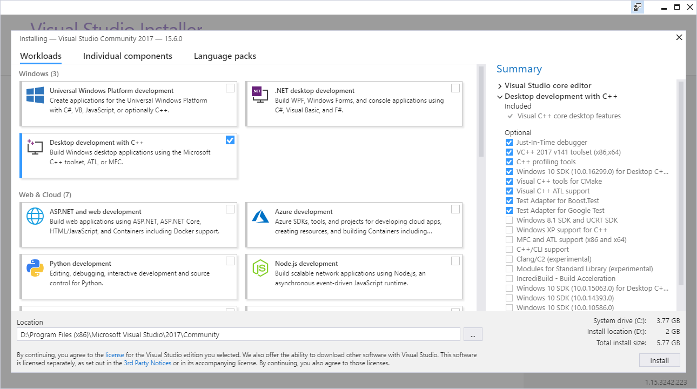
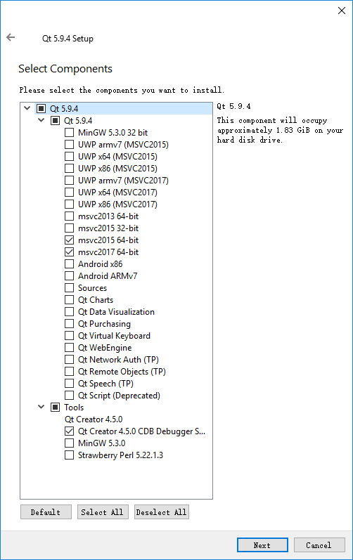
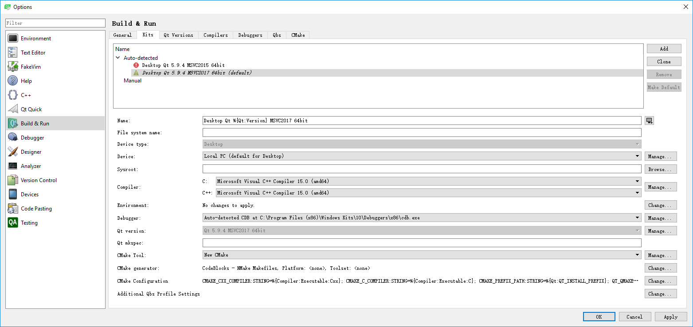
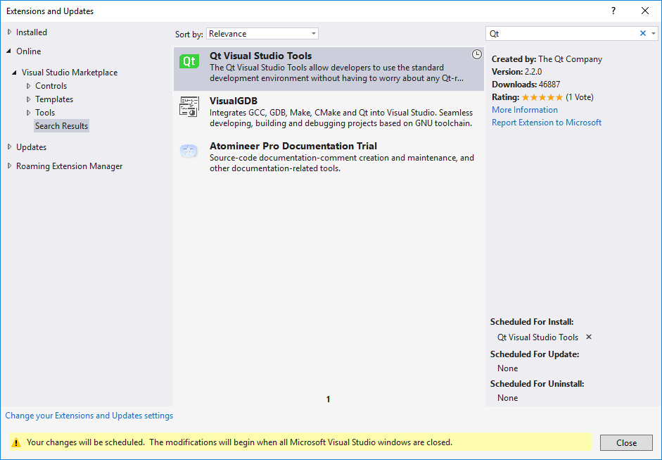
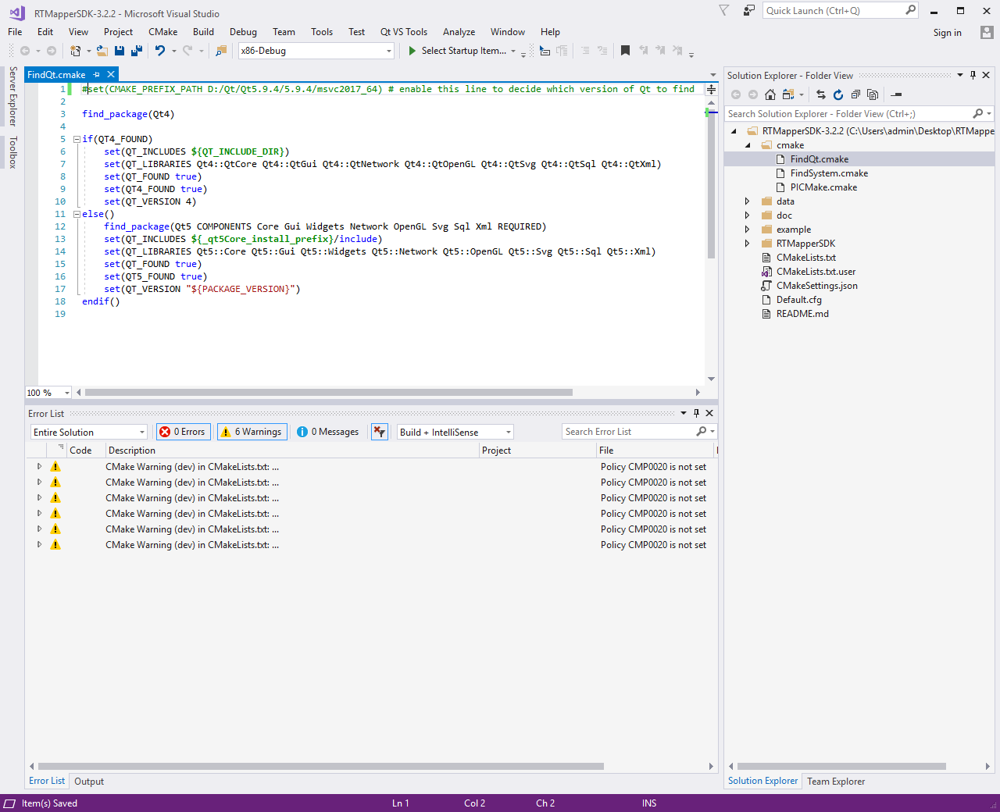
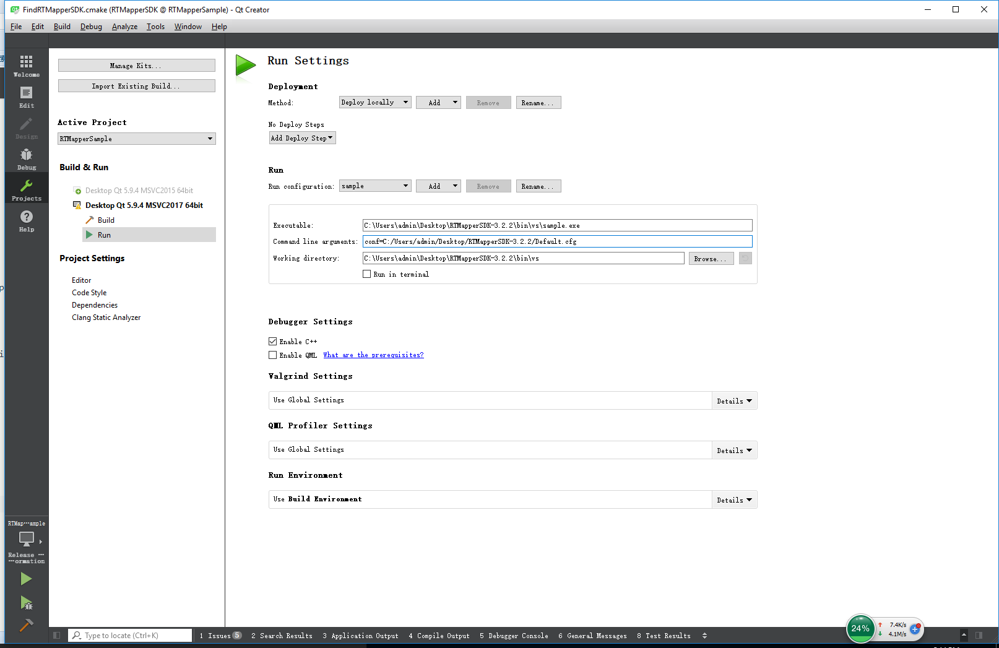

# Compile on Windows with CMake+VS2017+Qt5.9.4

---
## 1. Install Compile Enviroment

There are three things need to be installed:
1. CMake: https://cmake.org/download/
2. VS2017: https://www.visualstudio.com/downloads/
3. Qt5.9.4: http://download.qt.io/archive/qt/

### 1.1. Install CMake

Download the latest cmake version for windows such as **cmake-3.11.0-rc2-win64-x64.msi** and follow the wizard to install.

### 1.2. Install VS2017
Install VS2017 with C++ support:

### 1.3. Install Qt5.9.4
Download file **qt-opensource-windows-x86-5.9.4** and install with vs2017 support:

### 1.4. Configuration of QtCreator
Open QtCreator and go to Menu->Tools->Options->Build&Run->Kits, set **Desktop Qt %{Qt:Version} MSVC2017 64bit** to default and choose amd64 compiler.

### 1.5. Add Qt support for VS2017
1. Open VS2017 and go to Menu->Tools->Extensions and Updates.
2. Search Qt in Visual Studio Marketplace, download the plugin for VS and close vs to install.

## 2. Compile and Run
There are several ways to compile the sample code:
1. Open cmake with VS2017
2. Open cmake with QtCreator (recommend)
3. Use cmake to create vs project

### 2.1. Open cmake with VS2017
1. Open the CMakeLists.txt project folder:

2. If cmake can't find Qt, edit the first line of cmake/FindQt.cmake to tell cmake where to find Qt.

3. Choose x64-Release and click Menu->CMake->build all to build the sample. After sample.exe is built, select sample.exe and run.

4. Since the application needs qt5 and libRTMapperSDK.dll, please copy these dlls to the location of sample.exe or add PATHs of these folders.

### 2.2. Open cmake with QtCreator (recommend)
1. Open the CMakeLists.txt with QtCreator, select Release/Minimized Release/Release with debug info compile mode and compile.
2. Copy RTMapperSDK/lib/vs2015release/libRTMapperSDK.dll to bin/vs.
3. Run with arguments: conf=_path_/RTMapperSDK-3.2.2/Default.cfg

### 2.3. Use cmake to create vs project

Use cmake-gui application can also generate project files or nmake Makefile for vs.

